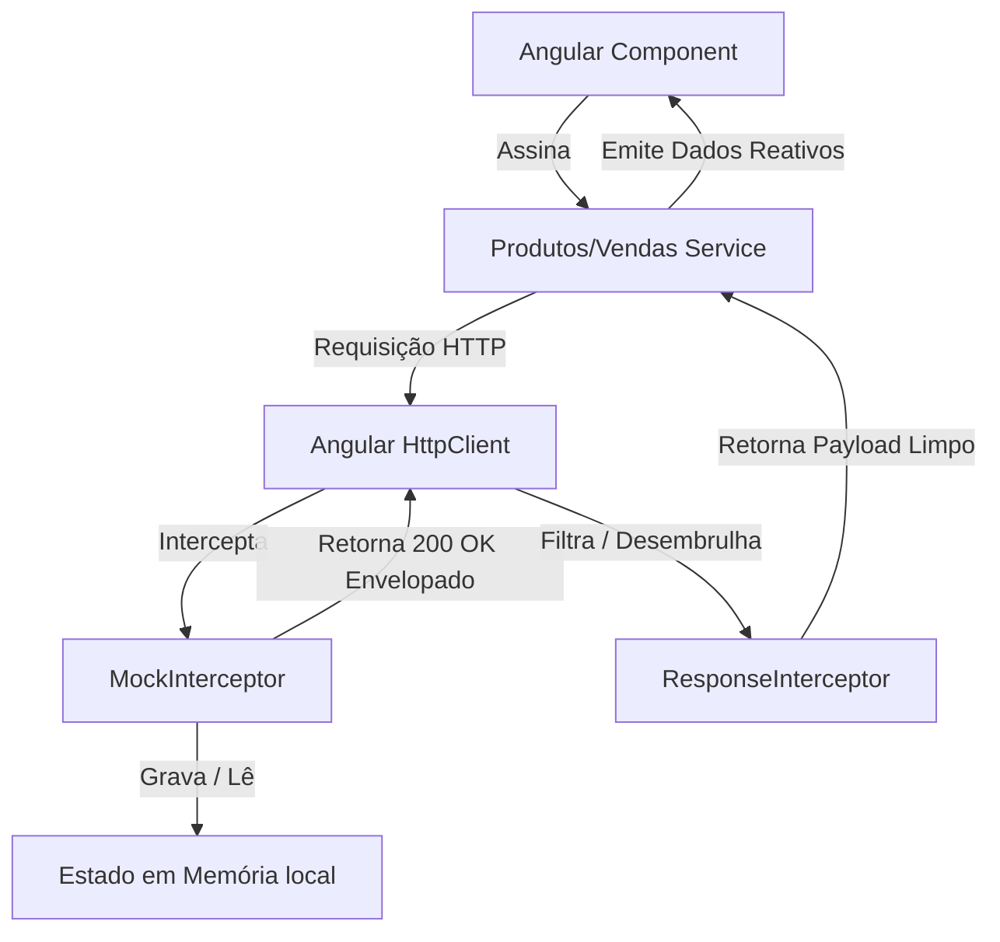
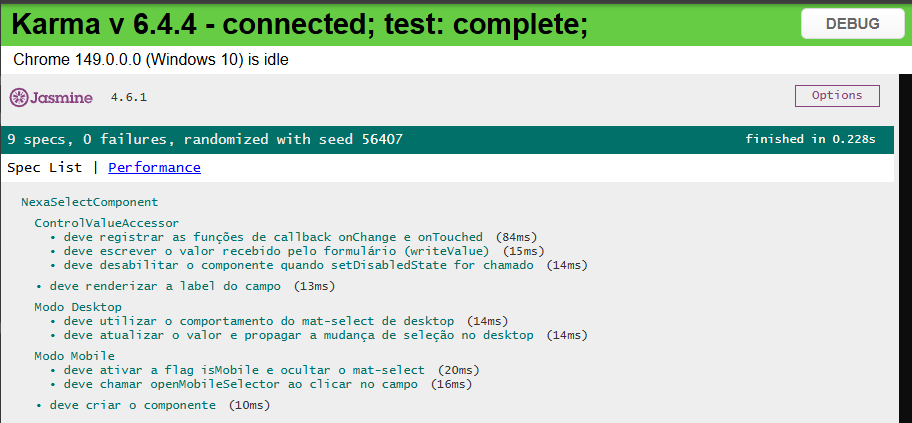

# ⚡ Nexa ERP Showcase — Angular Standalone & Zero-Backend Demo

[](https://angular.dev/)
[](https://www.typescriptlang.org/)
[](https://tailwindcss.com/)
[](LICENSE)

Este repositório contém a versão **showcase/demo standalone** do **Nexa ERP**, um sistema de gestão comercial avançado projetado para o segmento de varejo e materiais de construção.

Esta versão foi criada com o objetivo de demonstrar práticas de engenharia de software frontend para uma vaga de **Desenvolvedor Frontend Pleno**, com **100% dos dados mockados localmente** e sem nenhuma dependência de APIs externas vivas.

---

## 🔑 Acesso de Demonstração

Para navegar e testar todas as funcionalidades do sistema, utilize as seguintes credenciais na tela de login:

- **E-mail:** `demo@nexa.com`
- **Senha:** `demo123`

_Nota: O sistema simula um plano **PREMIUM** com papel de **SUPER_ADMIN** para dar acesso irrestrito às 17+ telas do ERP._

---

## 🚀 Como Rodar o Projeto Localmente

### Pré-requisitos

- [Node.js](https://nodejs.org/) (versão LTS recomendada)
- [Angular CLI](https://angular.dev/tools/cli) (opcional, pode rodar via npx)

### Passo a Passo

1. **Clonar o Repositório:**

   ```bash
   git clone https://github.com/seu-usuario/nexa-showcase.git
   cd nexa-showcase
   ```

2. **Instalar Dependências:**
   Instale os pacotes utilizando a flag de resolução de dependências legadas para contornar restrições estritas de peer dependencies do ecossistema Angular:

   ```bash
   npm install --legacy-peer-deps
   ```

3. **Iniciar Servidor de Desenvolvimento:**

   ```bash
   npm start
   # ou: npx ng serve
   ```

4. **Acessar o App:**
   Abra o navegador em [http://localhost:4200](http://localhost:4200).

---

## 🛠️ Tecnologias & Bibliotecas Utilizadas

- **Framework Principal:** Angular 21 (Componentes Standalone)
- **Linguagem:** TypeScript 5
- **Estilização:** Tailwind CSS (Utilitários) & Angular Material (Componentes)
- **Banco de Dados Local (Offline):** Dexie DB (Wrapper do IndexedDB do browser)
- **Gerenciamento de Fluxos:** RxJS 7 (Programação Reativa)
- **Mapeamento de Entradas:** ngx-mask (Máscaras de CPF, CNPJ, Telefone e CEP)

---

## 📐 Estrutura Arquitetural do Mock

A estratégia de simulação de backend é implementada de forma limpa usando a pipeline HTTP do Angular. Em vez de reescrever os serviços comerciais individuais (o que alteraria o código de produção), um único **`MockInterceptor`** intercepta as chamadas HTTP e simula um banco de dados relacional em memória com latência artificial de ~250ms.



### Endpoints Simulados pelo `MockInterceptor`

O interceptor mapeia **93 rotas de API** cobrindo todas as operações CRUD de:

- **Autenticação:** Login, validação de e-mail e registro de novo tenant (empresa)
- **Cadastros:** Clientes, Fornecedores, Produtos, Categorias e Usuários
- **Operações:** Vendas (PDV), Compras, Orçamentos e Emissão de Notas Fiscais (NF-e)
- **Financeiro:** Contas a pagar/receber e Dashboards operacionais
- **Logística:** Roteirização de Entregas, Cargas e Romaneios de Carregamento
- **BI & Relatórios:** Geração dinâmica de DRE (Demonstração do Resultado do Exercício), fluxo de caixa comparativo e ranking de produtos mais vendidos com base nas datas selecionadas.

---

## 💎 Práticas de Desenvolvimento Demonstradas

### 1. Reatividade Moderna com Angular Signals

Toda a renderização e propagação de estado compartilhado (como o usuário logado, logotipo ativo da empresa e contagem de itens do PDV) utiliza **Signals** do Angular 21. Isso elimina a dependência do zone.js em cenários de alta frequência de atualização, melhorando a performance e simplificando a lógica de templates.

### 2. Modo Offline-First Resiliente

O sistema simula resiliência a quedas de rede:

- Integração com **Dexie DB** no catálogo de produtos e clientes.
- Lógica de outbox para vendas realizadas offline (salvas em IndexedDB e sincronizadas em background quando a rede retorna).

### 3. Componentes Genéricos e Polimórficos

O componente customizado `NexaSelectComponent` é adaptativo:

- Em telas **Desktop**, renderiza um dropdown estilizado tipo painel flutuante.
- Em telas **Mobile**, abre automaticamente uma gaveta na parte inferior (_bottom-sheet_) para maximizar a usabilidade do operador de caixa.

### 4. Tratamento de Impressão e PDF

O `PrintService` lida com a renderização de documentos complexos (comprovantes térmicos de 80mm, contratos de crediário/fiado e relatórios A4) gerando layouts HTML temporários de forma isolada, evitando problemas com bloqueadores de pop-up nativos dos navegadores modernos.

### 5. Testes Unitários de Componentes Customizados

- Demonstração de cobertura de testes unitários para componentes complexos e adaptativos.
- O arquivo [nexa-select.component.spec.ts](file:///c:/Users/User/OneDrive/Área de Trabalho/meus-projetoos/nexa/nexa-showcase/src/app/shared/components/nexa-select/nexa-select.component.spec.ts) utiliza o `TestBed` do Angular, `BreakpointObserver` mocks e espionagem de chamadas para validar o comportamento polimórfico de renderização (Desktop/Mobile) e a integração do ciclo de vida com o `ControlValueAccessor`.

## 

## 📄 Licença

Este projeto está sob a licença MIT. Veja o arquivo [LICENSE](LICENSE) para mais detalhes.
